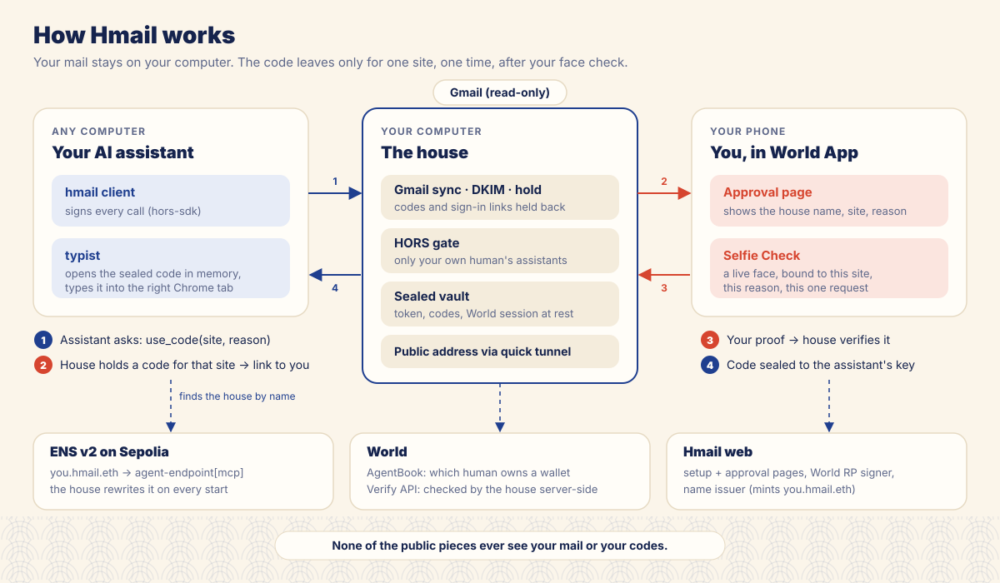
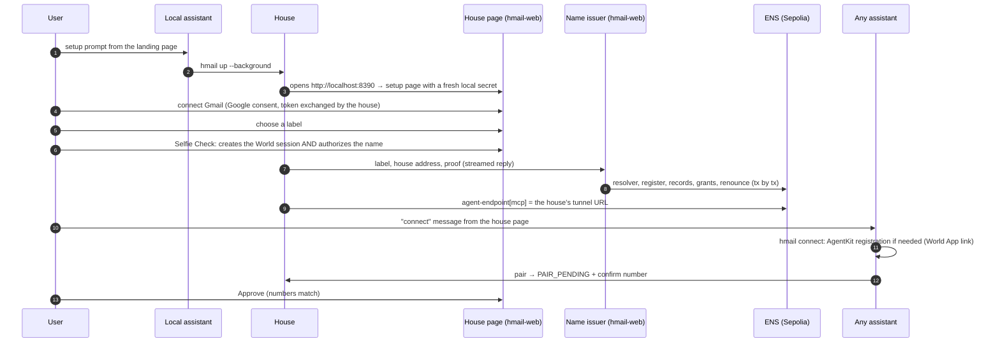

# How Hmail works

Hmail has three parts. **The house** runs on the user's computer and holds everything private.
**The assistant client** runs wherever the assistant runs, and never holds anything private.
**The web project** is a stateless site on Vercel that the house and the user's browser talk to.

| Part | Where | Holds | Code |
| --- | --- | --- | --- |
| House | the user's computer, `127.0.0.1:8390` plus a Cloudflare quick tunnel | Gmail token, held codes and links, World session, audit log, owner and deny list: all sealed at rest | `src/house/` |
| Assistant client | any computer (a laptop, or a cloud agent like Grok's) | a HORS profile wallet; a one-time X25519 key per code request, in memory only | `src/client/` |
| Web project | `hmail-web.vercel.app` | nothing per user; three server secrets (World RP signing key, name-issuer key, Google desktop client secret) | `web/` |
| ENS | Sepolia, ENSv2 | `<label>.hmail.eth` and its two endpoint records | `web/lib/issue-core.js`, `src/house/ens-sync.js` |
| World | World App, World's Verify API, AgentBook on World Chain | nothing of ours | `src/house/world/` |

## The house is a HORS-gated MCP server

The house serves MCP over streamable HTTP at `/mcp`. Every tool is registered through
[`hors-sdk/mcp`](https://github.com/cqlyj/hors), so a call reaches Hmail's code only after the gate has
verified the caller's signed envelope, resolved its wallet to a World ID `humanId` in AgentBook, and
applied the tool's policy.



| Tool | Origin | Rules (in order) | Middleware | What it does |
| --- | --- | --- | --- | --- |
| `ping` | `same-human` | | | health check; replies with the caller's `humanId` |
| `search` | `same-human` | | redaction net | Gmail search; held items appear as `[held · site · kind]` |
| `read` | `same-human` | | redaction net | one mail, hidden text removed, held items replaced |
| `attachment` | `same-human` | `notHeldMail` | | one attachment as an embedded resource (≤ 10 MB) |
| `use_code` | `same-human` | `heldCode`, `faceChecked` | redaction net | release a held login code, sealed to the caller |
| `pair` | `any-human` | `ownedByAnother` | | ask the owner to adopt this assistant's human |

How the house uses what `hors-sdk` offers:

- **Owner.** A new house has no owner, and its gate is pinned to an unmatchable sentinel `humanId`,
  so every `same-human` tool is closed. `pair` (open to any verified human) opens a request; when
  the owner approves it on the house page, the house saves that human as the owner and rebuilds the
  gate. From then on, **any** wallet registered to the same human passes, with no further pairing.
- **Rules.** Each rule runs after the origin check and before the handler, and can deny with a code
  and a challenge (`src/house/tools/`):
  - `heldCode`: a verified, unspent login code from this site arrived in the last 15 minutes, else
    `NO_HELD_CODE`. It hands the code's id to the next rule through `ctx.state`.
  - `faceChecked`: the first call opens a World approval and denies `APPROVAL_REQUIRED` with the link
    as the challenge. A retry with `hors/meta {"approvalId"}` passes only once that exact request is
    approved; otherwise `APPROVAL_PENDING`, `APPROVAL_DENIED`, `APPROVAL_EXPIRED`, `APPROVAL_USED` or
    `APPROVAL_UNKNOWN`. The handler then spends the approval and the code, once.
  - `notHeldMail`: attachments of a mail with held codes or links are refused (`HELD_MAIL`), so a file
    can never be a way around a held secret.
  - `ownedByAnother`: once a house has an owner, only that human's assistants may call `pair`
    (`ALREADY_PAIRED`).

  The rule timeout is raised to 25 s, because opening a World request calls the signer and IDKit.
- **Challenges and retries.** `use_code` and `pair` never block. The first call is denied with a
  machine-readable challenge (the approval link, or a `PAIR_PENDING` confirm number). The client
  retries with `hors/meta` (`approvalId` or `pairRequestId`) until the human has acted.
- **Middleware.** The redaction net wraps every mail tool. After the handler runs, it replaces any
  held secret that appears in the reply with its placeholder, and logs that it did so. It is a second
  line of defence behind the hold rules.
- **Deny list.** Revoking an assistant on the house page calls `gate.reload({ deny })`; that wallet is
  refused with `HORS_DENIED_WALLET` even though its human is the owner.
- **Store.** `ctx.hors.store.consumeOnce("release:<held id>")` makes a code releasable exactly once.
- **Audit events.** `gate.on("audit")` feeds the house page's list of assistants.
- **Published policies.** An unsigned `tools/list` shows every tool and its policy; the ENS inspector
  reads it live.

## Mail: what gets held

`src/house/gmail/` syncs the last day of mail every 15 s with the read-only Gmail scope.
`src/house/mail/` turns each message into what an assistant may see.

1. **Sender.** DKIM is verified with `mailauth`. A mail gets a *site* only if DKIM passes, the signing
   domain aligns with the `From` domain, the signature covers the whole body (no `l=`), and there is
   exactly one `From` header. The site is the registrable domain, with a small map for services that
   mail from another domain (`luma-mail.com` → `lu.ma`). A spoofed "ethglobal" mail therefore has no
   site, and nothing can ever be released for it.
2. **Visible text.** HTML is preferred over plain text. Text hidden with CSS (`display:none`, zero
   size, transparent colour, off-screen, and so on), `hidden`/`aria-hidden` elements and invisible
   characters are removed before anything else looks at the mail.
3. **Hold rules.** A mail is a code mail if it has a code-shaped token (4–8 digits, `123 456`,
   `ABCD-1234`, mixed letters and digits) and either a code-style subject ("verification code", "your
   code is") or a no-reply sender with "code"/"one-time" in the text. Links are held from no-reply,
   sign-in or verification mails when they look like magic, reset or new-device links; unsubscribe,
   help and social links are left alone. Every URL a reader could see is considered: link targets,
   link text, and bare URLs in the text.
4. **Placeholders.** Each held item is replaced by `[held · site · kind]`, with `unverified sender` in
   place of the site when DKIM did not give one. The held items go to the sealed store; the mail text
   an assistant receives never contains them.

Held items live for 24 hours. `use_code` only releases a verified, unspent login code received in the
last 15 minutes.

## Releasing a code

```mermaid
sequenceDiagram
  autonumber
  participant A as Assistant (hmail type)
  participant H as House
  participant P as Approval page
  participant W as World App
  participant V as World Verify API
  A->>A: check the visible Chrome tab is https://site
  A->>H: use_code(site, reason, recipientKey)  [signed; origin: same-human]
  H->>H: rule heldCode: verified code from site? else NO_HELD_CODE
  H->>H: rule faceChecked: open approval, signal = house · site · nonce · sha256(reason, key)
  H-->>A: denied APPROVAL_REQUIRED + approval link (the challenge)
  A-->>P: the human opens the link
  P->>P: resolve name: agent-endpoint[mcp] must match the house
  P->>W: Selfie Check (proveSession in the setup session)
  W-->>H: proof, through World's bridge (the house polls it)
  H->>V: verify, environment pinned to production
  A->>H: retry with hors/meta approvalId
  H->>H: rule faceChecked passes; handler spends approval and code once
  H-->>A: code sealed to recipientKey
  A->>A: check the tab again, open in memory, type, press Enter
```

- **Binding.** The approval is bound to the site, the reason and the assistant's one-time public key,
  both in the World signal and in the house's own record. A retry that changes any of them is
  `APPROVAL_UNKNOWN`.
- **Sealing.** X25519 key agreement with a fresh ephemeral key, HKDF-SHA256, then AES-256-GCM with the
  site and approval id as associated data. Only the typist that made the request holds the private key,
  and only in memory.
- **The typist.** It finds Chrome's DevTools port, requires exactly one visible tab whose origin is
  `https://<site>` (or a subdomain) with a text field focused, and checks this before asking and again
  after approval. It types the code one character at a time with `Input.insertText` and presses Enter.
  It never prints the code; errors are generic.
- **Limits.** An approval lives 3 minutes; a caller may have at most 2 pending (5 per house).

## Onboarding



- **The house page** is `setup.html` on the web project, talking to the local house through its setup
  API (`/setup/*`). Every call needs the per-run secret from the page's URL fragment *and* an `Origin`
  equal to the web project; `http://localhost:8390` hands out that secret only to requests from the
  machine itself (tunnel requests get 404).
- **Gmail.** Desktop OAuth with PKCE and a loopback redirect. The web project serves the desktop
  client id and secret; the house does the token exchange itself, so tokens never pass through us.
- **Name issuance** streams each step and transaction hash back through the house to the page, which
  shows a live timeline with Etherscan links. Details are in [ens.md](ens.md).
- **Background mode.** `hmail up --background` starts a detached house, writes `house.pid` and
  `house.log` in the state directory, and returns once it is ready. `hmail status`, `stop` and `open`
  manage it.

## State at rest

Everything is under the state directory (default `~/.hmail`, mode 700), sealed with AES-256-GCM using a
random key in `vault.key` (mode 600). Writes go to a unique temporary file and are renamed into place,
serialized per file.

| File | Contents |
| --- | --- |
| `gmail.enc` | Gmail refresh token and client |
| `held.enc` | held codes and links, with site, kind, verified, spent |
| `world.enc` | the World session id and its environment |
| `house.enc` | owner `humanId`, ENS name, deny list |
| `audit.enc` | the activity log (who asked for which site, what happened) |

The house's wallet (its HORS profile, which also owns its ENS name) lives in `~/.hors/hmail-house`.

## Hosted pieces

| Route | Does | Sees |
| --- | --- | --- |
| `POST /api/rp-context` | signs World RP requests with our RP key | a nonce request; nothing else |
| `GET/POST /api/issue` | checks label availability; verifies a setup proof with World and mints the name | label, house address, the setup proof |
| `GET /api/google-client` | returns the desktop OAuth client id and secret | nothing |
| `GET /api/resolve` | reads a name's two endpoint records (for the approval page) | the name |
| `GET /api/inspect` | records, roles and the house's unsigned `tools/list` (for the inspector) | the name |

## Threat model

**In scope, and how it is handled:**

| Threat | Defence |
| --- | --- |
| The assistant or model uses a code it read in the inbox | codes are held; mail tools never return them; the redaction net catches leaks |
| A prompt-injection mail ("type the code here") | hidden text is stripped; codes are never in the text; the typist only types into the site's own tab |
| A spoofed sender ("ethglobal" from elsewhere) | the site comes only from an aligned, full-body DKIM pass |
| Someone else's assistant | HORS: `same-human` only; unregistered wallets are `HORS_NOT_HUMAN`, other humans `HORS_ORIGIN_MISMATCH` |
| A revoked assistant of the owner | the house's HORS deny list |
| Replay of an approval or a code | single-use approvals, `consumeOnce`, spent flag |
| A phishing approval link on the real site | the page resolves the house's ENS name and refuses unless its `agent-endpoint[mcp]` matches |
| Our servers | never see mail, tokens or codes; the only secrets there are our own keys |
| Anyone moving a house's name | per-record roles: only the house key can write its two records; the issuer renounces |

**Out of scope:** malware already running as the user on the house computer (it could read the vault
key, as for any local app), a compromised phone or World account, and Google itself.
