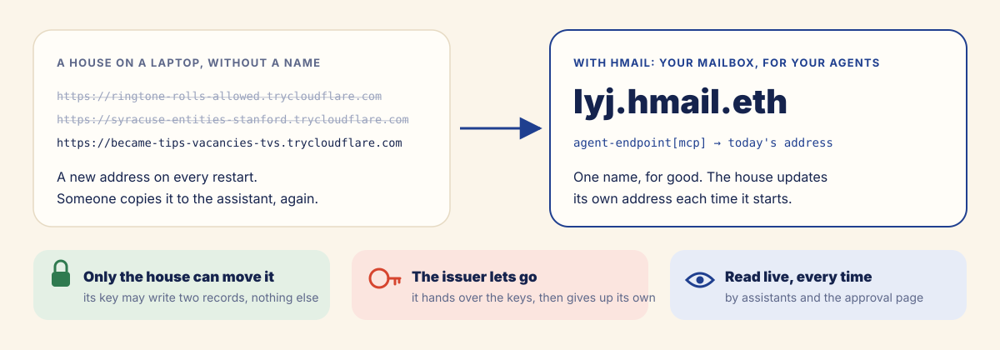
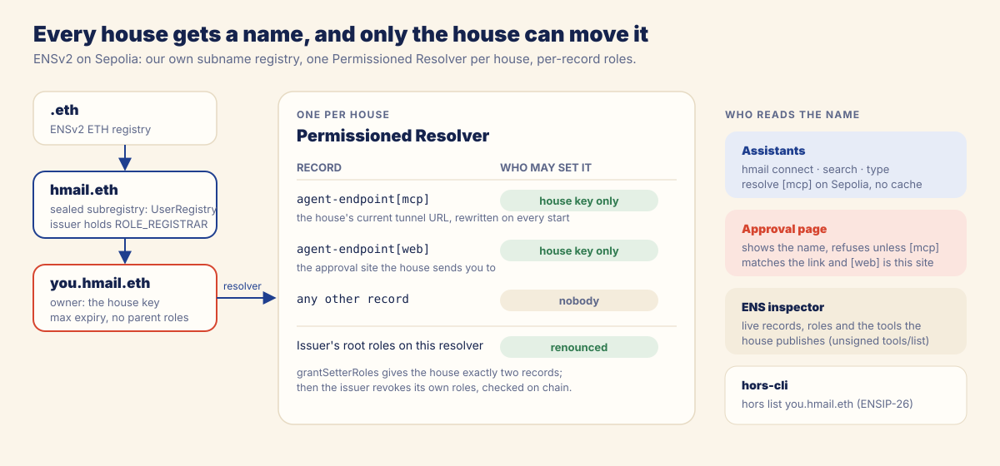

# ENS: your name is your mailbox

**In the agent era, your ENS name is your mailbox.** Give any of your assistants `lyj.hmail.eth` and
that is all it needs: it finds your house, proves it acts for you, reads your mail, and asks your face
before touching a login code.

To be precise: the name is not an email address. Nobody sends mail *to* `lyj.hmail.eth`, and your Gmail
stays your mailbox. The name is **how your agents reach that mailbox**: one short, permanent address,
wherever your house runs today, that only your house can move.

- **It works live.** Open [lyj.hmail.eth in the inspector](https://hmail-web.vercel.app/inspect.html?name=lyj.hmail.eth):
  its records, owner, resolver and roles are read from Sepolia at request time, and the house's own
  tool list is fetched from the address the name points to.
- **The name does real work.** A house runs on a laptop behind a free tunnel whose address changes on
  every start. Without the name, an assistant cannot reach it after a restart, and the approval page
  cannot tell a real approval link from a phishing one.
- **Every user gets one.** Setup mints a subname in about 45 seconds after one face scan, and hands
  control to the house.

## What ENSv2 adds to HORS

HORS already resolves services by name through ENSIP-26 `agent-endpoint[mcp]` records. What it could not
do alone is give **every user's own house** a name that stays correct when the house runs on a laptop
behind a free tunnel whose URL changes on every start, without anyone else holding control of that name.

| Without ENSv2 | With ENSv2 in Hmail |
| --- | --- |
| the assistant needs the house's URL, copied from a terminal after each restart | one name for good: `hmail connect lyj.hmail.eth` |
| the house either has no name, or someone else's key controls its records | the house key can set exactly its two endpoint records, and nothing else |
| the approval page cannot tell which house sent a link | the page shows the name and checks its `agent-endpoint[mcp]` against the link |
| a name issuer would keep power over every name it minted | the issuer renounces its roles on each house's resolver, checked on chain |

The ENSv2 features this relies on:

- **Hierarchical registry.** `hmail.eth` delegates to **our own `UserRegistry`**, a subregistry that
  mints `<label>.hmail.eth`.
- **Permissioned Resolver.** Each house gets **its own** resolver, a proxy deployed through
  `VerifiableFactory` at a deterministic address.
- **Enhanced Access Control, per record.** `grantSetterRoles(setText(name, key, ""), house)` gives the
  house key the `SET_TEXT` role on exactly one record key at a time. The house gets two:
  `agent-endpoint[mcp]` and `agent-endpoint[web]`.
- **Renouncing.** The issuer then calls `revokeRootRoles` on the resolver and holds no roles on it.

## How the name is built

## Issuing a name

A name is minted by the issuer (`web/lib/issue-core.js`, behind `web/api/issue.js`) after one World ID
Selfie Check. The proof's signal contains the house address and the label, so a proof for one house
and label cannot mint anything else. Issuance is idempotent and streams its progress:

| Step | Transaction | Batch |
| --- | --- | --- |
| create the house's resolver | `VerifiableFactory.deployProxy(PermissionedResolverImpl, salt, initialize(issuer: SET_TEXT \| SET_TEXT_ADMIN))` | 1 |
| top up the house for its own updates | 0.005 SepoliaETH, **only** on the call that registers the name | 1 |
| register the name to the house | `UserRegistry.register(label, house, …, resolver, roleBitmap 0, max expiry)` | 2 |
| point it at the Hmail web app | `setText(agent-endpoint[web], https://hmail-web.vercel.app)` | 2 |
| give the house its two record keys | `grantSetterRoles` × 2 | 2 |
| the issuer gives up its rights | `revokeRootRoles(SET_TEXT \| SET_TEXT_ADMIN, issuer)`, sent only after checking the house is the sole setter of both keys | 3 |
| the house publishes its address | `setText(agent-endpoint[mcp], <tunnel URL>)`, **signed by the house key** | house |

Transactions in a batch go out back to back with explicit nonces and gas limits, so a fresh name takes
three receipt waits: about 45 seconds from the face scan to a working name. The house page shows each
step live with its Etherscan link.

Other properties:

- **Safe to retry.** A replay of the same proof sends no transactions and no ETH.
- **Recovers from a half-finished issuance.** If the resolver was deployed but registration failed,
  the next attempt deploys under the next salt; the orphan stays unlinked.
- **Checked at the end.** Owner, resolver link, both setter roles (house only) and the issuer's
  renounce are verified on chain before the name is reported.

## Records

| Record | Value | Written by | Read by |
| --- | --- | --- | --- |
| `agent-endpoint[mcp]` | the house's MCP URL (its current tunnel) | the house key, on every start | `hmail` clients, `hors-cli`, the approval page, the inspector |
| `agent-endpoint[web]` | `https://hmail-web.vercel.app` | the issuer, once | the approval page (it must equal the page's own origin) |

**Self-healing.** The house gets a new tunnel URL each time it starts, and rewrites `agent-endpoint[mcp]`
with its own key (`src/house/ens-sync.js`). Assistants keep using the same name.

## The name as the front door

- **Assistants:** `hmail connect | search | read | type <name>` resolve the name on Sepolia through the
  Universal Resolver, with no cache (`src/shared/ens.js`, on `hors-sdk/resolvers`).
- **`hors-cli`:** `npx -y hors-cli list lyj.hmail.eth` with a Sepolia RPC in `hors.config.json` lists
  the house's tools and policies. `hors-cli` caches name lookups for an hour, so after a house restart
  the `hmail` client (no cache) is the reliable path.
- **The approval page** refuses a link unless the named house's `agent-endpoint[mcp]` origin equals
  the link's house and `agent-endpoint[web]` equals the page's own origin.
- **The ENS inspector** (`https://hmail-web.vercel.app/inspect.html?name=<name>`) reads the records,
  the owner, the resolver, whether only the house can set each record and whether the issuer has
  renounced, then asks the house for its unsigned `tools/list`.

Every value on these pages is read from Sepolia (or the live house) at request time. Nothing is hard-coded.

## On chain (Sepolia)

| Contract | Address |
| --- | --- |
| ENSv2 ETH registry | `0x657ea849311d3d5823348dded7c2aaafb3ede09e` |
| `hmail.eth` subregistry (our `UserRegistry`) | `0xbC1f7BA36e467EbB70aB4F59BadD1c181De8ED52` |
| `PermissionedResolver` implementation | `0x14f09fd05d4585759e54844dc9b00147131cf243` |
| `VerifiableFactory` | `0x9e726eb570beb6bceb495ab8cda7df517d4e841c` |
| Universal Resolver | `0xeeeeeeee14d718c2b47d9923deab1335e144eeee` |
| Issuer (registrar key) | `0xa38d4fa8de96C0284a079B10d27A68c8C15C3dd6` |

Example: `lyj.hmail.eth`, owner (house key) `0x635247cc5f0f9018a15c7c57632323073c9aa4b5`, resolver
`0x56b97417D3d3D1935188b43644237f94cDb9DB35`.
[Inspect it live](https://hmail-web.vercel.app/inspect.html?name=lyj.hmail.eth).

**`hmail.eth` is sealed.** The issuer revoked its own `SET_SUBREGISTRY` role and that role's admin on the
`hmail.eth` token (Sepolia tx `0xd742a6f9d46d693580da0c19ece4542122dcce9ab26b8017de4296661d4980c8`), so
nobody can swap the registry under existing names, or grant that right again. The issuer keeps
`ROLE_REGISTRAR` on the `UserRegistry` (it can mint *new* labels) and holds no role on any house's
resolver. `hmail.eth` is registered until 2031-09-25.

## What we chose not to do, and why

Two ideas would have made the name richer. We left both out, on purpose.

- **A subname for every assistant** (`grok.lyj.hmail.eth`, owned by that assistant's wallet). It would
  turn your name into a public list of your agents, and it would publicly link each agent's wallet to
  your name. AgentBook keeps exactly that link anonymous: a service learns that a wallet belongs to
  *some* verified human, and whether it is the same human as the owner, never who. Hmail keeps the list
  of your assistants on your house page, where only you see it.
- **Instructions for agents in a record** (an `agent-context` text telling any agent "this is a Hmail
  house; run `hmail connect`"). It would advertise to anyone who reads the name what sits behind it.
  The house gives the same instructions to *your* assistant through the connect message, and publishes
  its tools only to those who ask it directly.

The rule we followed: the name says where your house is, and nothing about you.

## Operator tools

`scripts/ens-issue.mjs`:

- `--bootstrap`: the one-time `hmail.eth` and `UserRegistry` setup.
- The default mode issues a subname with the same code as the hosted issuer.
- `--verify-only`: checks an existing name: owner, expiry, parent roles, the house as sole setter,
  no root roles for the house, the issuer's renounce, and resolution.
