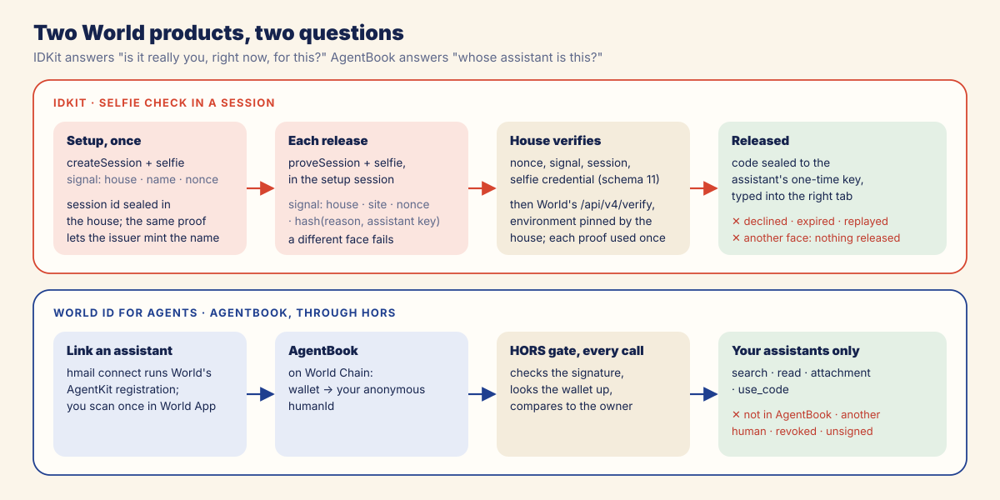
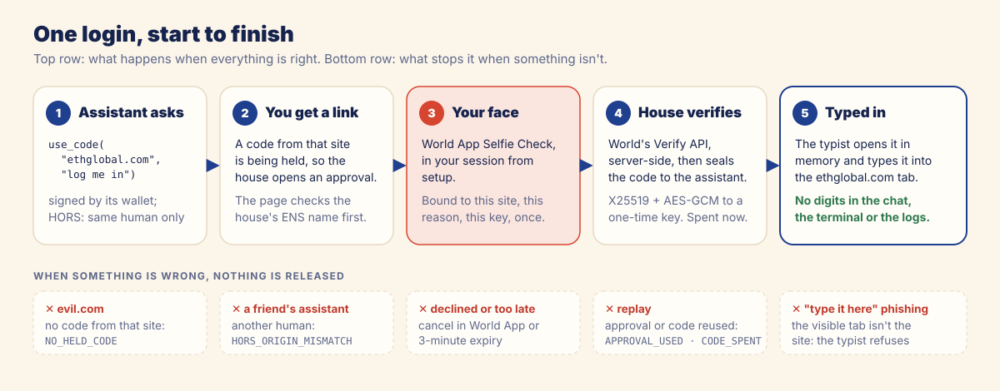

# World: the face behind every release, the human behind every assistant

Hmail uses World in two places, for two different questions.

| Question | World product | Where |
| --- | --- | --- |
| *Is it really my human, right now, approving this site?* | **IDKit**, Selfie Check credential, in a **session** | every code release; once at setup |
| *Which human does this assistant belong to?* | **World ID for Agents**: AgentBook, through HORS | every call to the house |



## The trust moment

A login code in an inbox is a key. Whoever reads it can sign in as you, and today that includes any
assistant with Gmail access. The product event that needs trust is **releasing one held login code to
one site**. Before that happens, Hmail needs to know three things:

1. a **real, live person** is approving, not a script or the assistant itself;
2. it is **the same person** who set up the house, not just any verified human;
3. they are approving **this site, for this reason, for this request**, and nothing else.

## Why a Selfie Check session

| Option | Why not, or why |
| --- | --- |
| Orb "Proof of Human" | proves a unique human once, but says nothing about who is holding the phone at release time |
| Document credentials (passport, ID) | identity data Hmail has no reason to see; still not a live check |
| Device | proves a device, not a person |
| **Selfie Check** | a **live face** check each time, which is what "a person approves this, now" needs |
| **…in a session** | `createSession` at setup ties the house to one person; every release is a `proveSession` in that session, so only the same person can approve. A different face cannot produce a proof for the house's session |

The site, reason and request are bound into the credential's **signal**:

```
setup:    hmail/v1/setup/<house address>/<label>/<nonce>
release:  hmail/v1/release/<house address>/<site>/<nonce>/<sha256(reason, recipientKey)[:32]>
```

The nonce is 16 random bytes per request. `recipientKey` is the assistant's one-time public key, so the
proof also pins *who* will receive the sealed code. The request is built with
`.constraints(CredentialRequest("selfie", { signal }))`.

## Server-side verification

Nothing is released on the word of a browser.

- **The RP signature** comes from our signer (`web/api/rp-context.js`). The RP signing key is a Vercel
  secret; the house and the pages never see it. The house fetches an `rp_context` per request.
- **The face check is a HORS rule on `use_code`** (`faceChecked`). No approved proof means the call
  never reaches the code that releases anything.
- **The house polls World's bridge itself** (`src/house/world/approvals.js`); the approval page only
  shows the QR and the World App link. The page cannot report a result.
- **The house verifies every proof** (`src/house/world/verify.js`) before it releases anything:
  - protocol version, `session_` id, one Selfie response with `issuer_schema_id` 11;
  - the proof's nonce equals the RP context nonce it asked for;
  - `signal_hash` equals the hash of the signal it built;
  - for releases, the session id equals the one saved at setup;
  - then `POST https://developer.world.org/api/v4/verify/{rp_id}` with `environment` **pinned by the
    house** (production), and the response must say success in the same environment;
  - each nullifier is accepted once.
- **The name issuer** (`web/api/issue.js`) verifies the setup proof the same way, with production
  pinned, before minting a name. The label and house address are in the signal, so a proof for one
  house and label cannot mint another.

No client secret is ever exposed: the RP key and the issuer key stay on Vercel; the Gmail token and the
World session stay in the house's sealed vault.

## The paths, success and otherwise




| Path | What happens | What the user or assistant sees |
| --- | --- | --- |
| ✅ **approve** | proof verified, code sealed and typed | page: "Approved"; typist: `typed into ethglobal.com, code spent` |
| ✖ **decline in World App** | IDKit returns `user_rejected`; nothing sealed | page: "You declined"; assistant: `denied APPROVAL_DENIED` |
| ✖ **too slow** | the approval expires after 3 minutes | page: "This request expired"; assistant: `denied APPROVAL_EXPIRED` |
| ✖ **different face** | a second person's Selfie Check does not prove the house's session | `APPROVAL_DENIED`; nothing released |
| ✖ **replay** | the approval or the code was already used | `APPROVAL_USED` or `CODE_SPENT` |
| ✖ **changed request** | another site, reason or key on retry | `APPROVAL_UNKNOWN` |
| ✖ **no code from that site** (`evil.com`) | refused before any World request | `NO_HELD_CODE` |
| ✖ **phishing link** on the real approval site | the page's ENS check fails | "This link doesn't match `<name>`. Don't approve it." |

All of these were run live against World production, including a second person trying to approve.

## World ID for Agents: which human owns this assistant

Every assistant has a wallet (a HORS profile). The human links it to their World ID once, in World App,
and **AgentBook** on World Chain records that the wallet belongs to their anonymous `humanId`. Hmail
never talks to AgentBook directly: the HORS gate in front of the house does, on every call.

**Linking an assistant** is built into `hmail connect <name>` (`src/client/connect.js`):

1. create the assistant's wallet if it has none;
2. look it up in AgentBook; if it is not registered, run World's `@worldcoin/agentkit-cli register`,
   which prints a World App link for the human (the assistant relays it; the house page can turn it
   into a QR);
3. wait until the registration lands on World Chain, then ask the house to pair.

**The protected application** is the house itself. Its `search`, `read`, `attachment` and `use_code`
tools are `same-human`: HORS resolves the caller's wallet to a `humanId` and admits it only if it equals the
house owner's.

| Caller | Result |
| --- | --- |
| the owner's assistant (any of their wallets) | ✅ admitted; `pong caller=<humanId>` |
| a wallet not in AgentBook | ✖ `HORS_NOT_HUMAN` |
| a friend's assistant (another human) | ✖ `HORS_ORIGIN_MISMATCH` |
| the owner's assistant after **Revoke** | ✖ `HORS_DENIED_WALLET` |
| an unsigned or tampered call | ✖ denied by the gate before any Hmail code runs |
| AgentBook or the signature RPC unreachable | ✖ `HORS_UNAVAILABLE` (fails closed) |

**Pairing** uses the same identity. `pair` is `any-human`: any assistant that is linked to *a* World ID
may ask, but only the owner can approve, on the house page, after checking that the 6-digit number
matches what their assistant shows. The house then pins that `humanId` as its owner. A second assistant
of the same human connects immediately; another human gets `ALREADY_PAIRED`.

## Where to look in the code

| Concern | File |
| --- | --- |
| IDKit loading in Node (WASM shim) | `src/house/world/idkit.js` |
| setup session, signal | `src/house/world/setup.js`, `src/house/world/signals.js` |
| approvals: create, poll, settle, consume | `src/house/world/approvals.js` |
| proof checks and World verify | `src/house/world/verify.js` |
| RP signer | `web/api/rp-context.js` |
| issuer's proof check | `web/api/issue.js` |
| AgentBook registration for assistants | `src/client/connect.js` |
| HORS gate and owner | `src/house/gate.js`, `src/house/tools/pair.js` |
